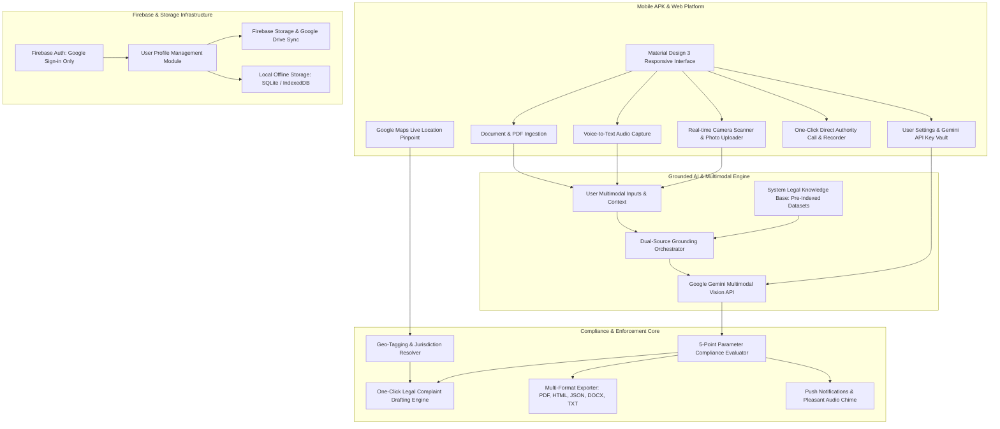
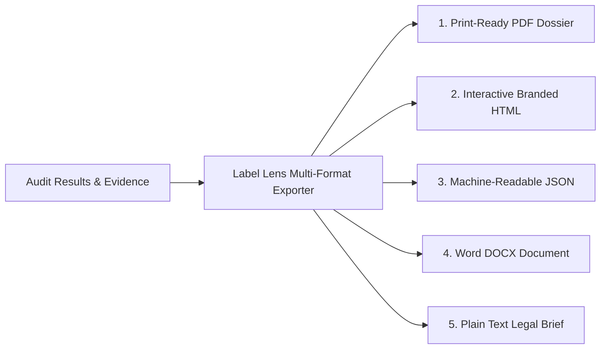

# LABEL LENS AI: SYSTEM ARCHITECTURE & TECHNICAL SPECIFICATION
**Mobile Application (Android APK) & Responsive Web Platform**  
*Next-Generation Multimodal Legal Metrology & Food Safety Regulatory Verification Engine*

---

## 1. PROJECT OVERVIEW & ARCHITECTURAL FOUNDATIONS

### 1.1 Executive Vision
**Label Lens AI** is an enterprise-grade legal metrology and food safety auditing ecosystem available as an **Android Mobile Application (APK)** and a **Responsive Web Application**. The system enables consumers, legal practitioners, retail quality auditors, and government enforcement officers to scan packaged commodities using multimodal inputs (high-resolution photographs, real-time video camera scanning, voice dictation transcripts, and raw text descriptions).

The platform is strictly grounded in verified Indian statutory frameworks:
1. **The Legal Metrology Act, 2009** (Act No. 1 of 2010) & the **Jan Vishwas Act, 2023/2026** decriminalization frameworks.
2. **The Legal Metrology (Packaged Commodities) Rules, 2011** (incorporating 2017, 2022, 2023, and latest **2025/2026 amendments**).
3. **The Food Safety and Standards Act, 2006** (Act No. 34 of 2006).
4. **FSSAI Labelling & Display Regulations, 2020**.
5. **FSSAI Packaging Regulations, 2018** (IS 15495 non-toxic inks, overall migration limits $\le 60\text{ mg/kg}$, newspaper ban).
6. **FSSAI Food Products Standards & Food Additives Regulations, 2011** (INS positive lists, banned synthetic dyes).
7. **FSSAI Contaminants, Toxins & Residues Regulations, 2011** (Heavy metals, Aflatoxins, MRLs).
8. **FSSAI Advertising & Claims Regulations, 2018** (Protected claims, 2024 fruit juice and ORS directives).
9. **FSSAI Prohibition & Restrictions on Sales Regulations, 2011** (Regulation 2.3.15 loose oil ban, Khesari dal $\le 2\%$ tolerance).
10. **State Authority Enforcement Mandates:** Maharashtra Legal Metrology (Enforcement) Rules, 2011, eMaap digital inspection sync, and Maharashtra FDA Section 30(2)(a) Gutkha/scented supari absolute bans.

---

### 1.2 System Architecture Diagram



---

## 2. MULTIMODAL INGESTION & USER SETTINGS SUBSYSTEM

### 2.1 Multimodal Input Channels
The system accommodates four distinct, real-time input modalities:
1. **Live Camera Scanner & Multi-Angle Photos:**
   - Real-time bounding box detection with guided framing (front Principal Display Panel, back nutrition/ingredients panel, side panels, barcode/QR code, top/bottom date stamps).
   - Automated perspective correction (homography alignment) and 3D surface dewarping for curved packaging (cans, bottles, tetra packs).
2. **Voice-to-Text Data Capture:**
   - Web Speech API / Android Native SpeechRecognizer capturing spoken product observations (e.g., *"Purchased at Mumbai airport for ₹150 while pack says MRP ₹90"*).
   - Audio transcription parsed by NLP to isolate incident details, vendor identity, and pricing discrepancies.
3. **Raw Text Descriptions & OCR Pasting:**
   - Direct text input for e-commerce listings, merchant URLs, or copied label text.
4. **Document & Supplementary File Uploads:**
   - Ingestion of laboratory chemical reports, purchase invoices, cash receipts, and supplier spec sheets (PDF, PNG, JPEG).

### 2.2 Secure API Key Configuration & Storage
*   **Zero Hardcoding Policy:** The system provides a dedicated **Settings Screen** allowing users to input and connect their personal **Google Gemini API Key** (or use an institutional fallback key).
*   **Security Architecture:**
    - Stored locally using AES-256 encrypted storage (`EncryptedSharedPreferences` on Android; AES-GCM encrypted `localStorage` / `IndexedDB` on Web).
    - API keys are injected at runtime into client-side API requests or ephemeral proxy sessions and are **never logged or persisted to backend servers**.
    - Real-time validation ping to Gemini API (`gemini-1.5-pro` or `gemini-2.0-flash`) verifying quota, latency, and key validity before saving.

---

## 3. GROUNDED DUAL-SOURCE AI COMPLIANCE ENGINE

### 3.1 Dual-Source Grounding Mechanism
To eliminate hallucinations and guarantee court-admissible outputs, the Gemini API synthesizes two isolated, strictly defined knowledge streams:

```
+──────────────────────────────────────────────────────────────────────────────────────────────────+
|                                  DUAL-SOURCE GROUNDING MATRIX                                    |
+───────────────────────────────────────────────┬──────────────────────────────────────────────────+
| SOURCE 1: SYSTEM LEGAL KNOWLEDGE BASE         | SOURCE 2: USER MULTIMODAL INPUTS                 |
| (Pre-Indexed Statutory Grounding)             | (Dynamic Incident & Product Evidence)            |
+───────────────────────────────────────────────┼──────────────────────────────────────────────────+
| • LMPC Rules, 2011 (Rules 1-34 & Schedules)   | • High-res packaging photos & multi-angle scans  |
| • PCR Amendments 2025 (Medical Devices, Pan M)| • Live camera frame OCR / barcode reading        |
| • PCR Amendments 2026 (Origin Filter 6(10A))  | • Voice dictation transcript (incident context)  |
| • FSSA, 2006 (Sections 3, 23, 24, 50-65)      | • Uploaded cash receipts / merchant POS invoices |
| • FSS Labelling & Display Regulations, 2020   | • User-entered text descriptions                 |
| • FSS Packaging Regulations, 2018 (OML, inks) | • GPS live location coordinates                  |
| • FSS Additives & Contaminants Regs, 2011     | • Attached lab test certificates (if any)        |
| • FSS Advertising & Claims Regs, 2018         |                                                  |
| • Maharashtra FDA & Legal Metrology Rules     |                                                  |
+───────────────────────────────────────────────┴──────────────────────────────────────────────────+
                                                │
                                                ▼
+──────────────────────────────────────────────────────────────────────────────────────────────────+
|                          STRICT CONSTRAINED DUAL-GROUNDING SYNTHESIS                             |
|  1. Extract observed entity attributes from Source 2 (User Packaging Data).                      |
|  2. Cross-reference observed value against exact threshold/clause in Source 1 (Statutory Base).   |
|  3. Validate mathematical formulas (USP, MPE, Character Ratio, Font Height Table-I).             |
|  4. Output structured legal determination: Compliant / Non-Compliant / Warning with citation.    |
+──────────────────────────────────────────────────────────────────────────────────────────────────+
```

---

### 3.2 Output Specification: The 5-Point Parameter Evaluation Schema

For every single audited parameter, the engine must output strictly structured findings adhering to the following schema:

```json
{
  "parameter_name": "String (e.g., Font Size Compliance, Declared MRP, Unit Sale Price)",
  "observed_value": "String (Exact extracted text, dimension, or calculated value from packaging)",
  "regulatory_clause": "String (Exact Act, Rule, Regulation, and Section number)",
  "status": "Enum ['Compliant', 'Non-Compliant', 'Warning']",
  "legal_reasoning": "String (Clear, step-by-step statutory justification explaining WHY it is correct or illegal)"
}
```

#### Complete Core Analysis Objectives & Parameter Catalog:

1.  **Mandatory Declarations:**
    *   *Manufacturer / Packer / Importer Identity:* Rule 6(1)(a) & Rule 10 (Premises, City, State, PIN code).
    *   *Country of Origin:* Rule 6(1)(a) & Rule 6(10A) (Mandatory on pack and e-commerce filter).
    *   *Common or Generic Commodity Name:* Rule 6(1)(b) (Prominent on PDP).
    *   *Net Weight / Quantity in Standard SI Units:* Rule 6(1)(c), Rules 11–13, First Schedule MPE.
    *   *Retail Sale Price (MRP):* Rule 6(1)(e) (Inclusive of all taxes, no price overlay stickers).
    *   *Unit Sale Price (USP):* Rule 6(11) (Per g/kg/ml/l/m/piece, rounded to 2 decimals).
    *   *Dates & Timestamps:* Rule 6(1)(d) & FSSAI Reg 5(6) (Mfg Date, Expiry Date grouped together).
    *   *Batch / Lot Number:* FSSAI Reg 5(7) & LMPC norms.
    *   *Consumer Care Details:* Rule 6(1)(f) (Designation, address, phone, email).
2.  **Technical & Print Compliance:**
    *   *Font Size Compliance:* Rule 7 Table-I ($A_{\text{pdp}}$ based scaling: $1.0\text{ mm}$ to $6.0\text{ mm}$).
    *   *Character Aspect Ratio:* Rule 7(3) (Width $\ge 33.3\%$ of height, except '1' and 'I').
    *   *Contrast Ratio & Conspicuousness:* Rule 8 (Distinct against packaging substrate).
    *   *Dietary Iconography:* FSSAI Reg 5(4) (Veg green circle, Non-Veg brown triangle, Vegan logo with exact dimensions).
    *   *Barcode / QR Code Validity:* EAN-13 / GS1 verification and 2022 Second Amendment QR rules.
3.  **Health & Safety Compliance:**
    *   *Ingredient Disclosure & Percentages:* FSSAI Reg 5(1) (Descending order, compound ingredients).
    *   *Nutritional Profile:* FSSAI Reg 5(3) (Dual declaration per $100\text{ g/ml}$ AND per serve % RDA).
    *   *Mandatory 8 Allergens:* FSSAI Reg 5(5) (Declared in **bold** or in `Contains: ...` callout box).
    *   *Food Additive & E-Number Validation:* Appendices A & B (Functional classes, permissible INS limits).
    *   *Toxic Additive & Synthetic Dye Screening:* Ban on Potassium Bromate, Metanil Yellow, Rhodamine B.
4.  **Marketing, Packaging & Misrepresentation:**
    *   *Misleading Claims:* FSSAI Claims Regs 2018 (Protected terms: *"Natural"*, *"Fresh"*, *"Pure"*).
    *   *Prohibited Juice & Drink Claims:* Ban on *"100% Fruit Juice"* on reconstituted drinks; ban on *"ORS"* on synthetic beverages; ban on *"Health Drink"* on malt products.
    *   *Deceptive Imagery & Slack Fill:* Contrast between pictorial fruit representation and actual fruit content; excessive empty headspace.
    *   *Packaging Material Integrity:* FSS Packaging Regs 2018 (IS 15495 inks, OML $\le 60\text{ mg/kg}$, newspaper ban).

---

## 4. ONE-CLICK AUTOMATED COMPLAINT DRAFTING ENGINE

When the audit engine identifies critical violations (e.g., adulteration, expired food, overcharging, missing MRP/USP, deceptive health claims, or contraband items like Maharashtra Gutkha), the user can generate a **court-ready legal complaint** in a single click.

```
+──────────────────────────────────────────────────────────────────────────────────────────────────+
|                           FORMAL LEGAL COMPLAINT DOSSIER STRUCTURE                               |
+──────────────────────────────────────────────────────────────────────────────────────────────────+
|                                                                                                  |
|  BEFORE THE HON'BLE DISTRICT CONTROLLER OF LEGAL METROLOGY /                                     |
|  DESIGNATED OFFICER & FOOD SAFETY OFFICER (FSSAI), GOVERNMENT OF MAHARASHTRA / INDIA             |
|                                                                                                  |
|  IN THE MATTER OF:                                                                               |
|  Complainant: [Full Name, User Address, Contact Phone, Verified Gmail]                           |
|  Versus                                                                                          |
|  Respondent(s): [Brand Owner, Registered Manufacturer, Packer, Marketer, Retail Vendor]          |
|                                                                                                  |
|  FORMAL SUBJECT LINE:                                                                            |
|  STATUTORY COMPLAINT UNDER SECTION 18 & 36 OF THE LEGAL METROLOGY ACT, 2009 AND                  |
|  SECTIONS 23, 24, 52, & 53 OF THE FOOD SAFETY AND STANDARDS ACT, 2006 IN RESPECT OF              |
|  [PRODUCT NAME, BRAND NAME, BATCH NUMBER] FOR SEVERE LABELLING & METROLOGICAL VIOLATIONS        |
|                                                                                                  |
|  1. JURISDICTIONAL & INCIDENT DETAILS:                                                           |
|     • Incident Date & Time: [Timestamp]                                                          |
|     • Location of Incident / Retail Vendor: [Vendor Name, Address]                               |
|     • Geo-Tagging Coordinates: [Latitude, Longitude, Google Maps Link]                            |
|                                                                                                  |
|  2. RESPONDENT ENTITY PARTICULARS:                                                               |
|     • Brand / Trademark: [Extracted Brand]                                                       |
|     • Manufacturer Name & Premises Address: [Extracted Address with PIN]                         |
|     • FSSAI License Number: [14-digit Number & FoSCoS Status]                                    |
|                                                                                                  |
|  3. ITEMIZED EVIDENTIARY SUMMARY & STATUTORY VIOLATIONS:                                         |
|     [Item 1: Parameter, Extracted Value, Exact Law Violated, Legal Justification]               |
|     [Item 2: Parameter, Extracted Value, Exact Law Violated, Legal Justification]               |
|                                                                                                  |
|  4. EMBEDDED EVIDENCE REFERENCES:                                                                |
|     • Packaging Photographs: [High-Resolution Front, Back, Nutritional, and MRP Photos]          |
|     • Barcode / QR Code Payload: [GS1 / EAN Data]                                                |
|     • Cash Memo / Invoice Reference: [Receipt Number & Paid Amount vs Printed MRP]               |
|     • SHA-256 Digital Hash of Evidence Files: [Cryptographic Hash for Court Admissibility]       |
|                                                                                                  |
|  5. FORMAL PRAYER / STATUTORY RELIEF DEMANDED:                                                   |
|     (a) Initiate immediate inspection and seizure of non-compliant batch under Sec 15 of LM Act  |
|         and Sec 38 of FSSA, 2006;                                                                |
|     (b) Institute penal proceedings / compounding under Sec 36 of LM Act and Sec 52/53 of FSSA; |
|     (c) Order product recall from retail and e-commerce distribution corridors;                  |
|     (d) Grant compensation to the complainant under Section 65 of FSSA, 2006.                    |
|                                                                                                  |
|  VERIFICATION & SIGNATURE                                                                        |
+──────────────────────────────────────────────────────────────────────────────────────────────────+
```

---

### 4.1 Google Maps MCP Live Location Integration
*   **Workflow:**
    1.  When generating the complaint, the app triggers an in-app confirmation modal:
        > *"Would you like to include your current live location in this official complaint to assist enforcement officers in identifying the vendor/incident location?"*
    2.  Upon user consent, the **Google Maps MCP / Geolocation Service** captures:
        - Exact GPS coordinates (`Latitude: 18.5204° N, Longitude: 73.8567° E`)
        - Formatted physical street address, locality, landmark, and postal PIN code via Reverse Geocoding.
        - Jurisdictional administrative district (e.g., *"Pune Division, Maharashtra"*).
        - Generates a secure, clickable **Google Maps location link** embedded directly into the complaint dossier.

---

## 5. ONE-CLICK MULTI-FORMAT REPORT GENERATION & EXPORT ENGINE

Users can generate and download audit reports in **five distinct formats** with a single click:



### Format Specifications:
1.  **Print-Ready PDF Dossier:**
    *   Official "Label Lens AI" corporate header and watermark.
    *   Summary compliance scorecard ($0 - 100\%$).
    *   Tabular parameter findings with color-coded status badges (**Green = Compliant**, **Amber = Warning**, **Red = Non-Compliant**).
    *   Embedded side-by-side packaging photographs with annotated visual bounding boxes.
    *   Digital timestamp, device metadata, and cryptographic SHA-256 evidence hash.
2.  **Interactive Branded HTML Report (`.html`):**
    *   Single-file, self-contained responsive web report styled with Tailwind CSS / Label Lens AI Design System.
    *   Interactive filtering (Show Only Violations, Show All, Filter by FSSAI/LMPC).
    *   Embedded high-res modal photo zoom.
    *   **Direct Action Triggers:** Built-in buttons for *"Send via Email"* and *"Direct Portal Dispatch"*.
3.  **Structured JSON Export:**
    *   Full schema containing metadata, extracted fields, parameter findings array, MPE calculations, and complaint payloads for integration with third-party portals or ERP systems.
4.  **Microsoft Word Document (`.docx`):**
    *   Fully editable legal brief formatted with standard headings, tables, and statutory citations for legal practitioners and advocates.
5.  **Plain Text Legal Brief (`.txt`):**
    *   Lightweight, clean ASCII formatted text dossier optimized for rapid pasting into government grievance portals (CPGRAMS, NCH, FoSCoS).

---

## 6. ONE-CLICK DIRECT AUTHORITY CALLING & CALL RECORDING

### 6.1 State-Specific Authority Routing
The platform integrates an automated directory of national and state-level food safety and legal metrology helplines:
*   **National Helplines:**
    - FSSAI National Toll-Free Helpline: `1800-11-2100`
    - National Consumer Helpline (NCH): `1915` / `1800-11-4000`
*   **State-Specific Directories (All 28 States & 8 UTs):**
    - Maharashtra FDA Head Office (BKC, Mumbai): `022-26592200` / Toll-free `1800-222-365`
    - Maharashtra Legal Metrology Control Room: `022-22886666`
    - Delhi Food Safety Department: `1800-11-0440`
    - Karnataka Food Safety Commissionerate: `080-22255764`
*   **Single-Click Action:**
    - The app detects the user's current state via GPS / User Profile and renders a prominent **"Call Authority"** button.
    - A single tap initiates a phone call directly to the competent regional jurisdiction without requiring manual number searching.

### 6.2 In-App Call Recording Module
*   **Functionality:** When placing a call to enforcement helplines or merchant consumer care numbers, users can activate the built-in **Call Recording Toggle**.
*   **Storage & Evidence Attachment:**
    - Recorded audio files (`.m4a` / `.wav`) are encrypted and saved in the app's local offline case directory.
    - Automatically uploaded to the user's secure Cloud Storage (Google Drive / Firebase) and appended to the active case file as supporting legal evidence.

---

## 7. CHAT WITH LABEL LENS AI ASSISTANT

### 7.1 In-Chat RAG Architecture
*   A dedicated conversational assistant powered by the user's configured Gemini API key.
*   **Strict Grounding Protocol:** The assistant is bound by system instructions to answer queries solely through the lens of Indian legal metrology and food safety statutes. Every response must cite the governing Act, Rule, Regulation, and Section number.
*   **In-Chat Multimodal Uploads:**
    - Users can attach product photos, invoice receipts, and multi-page PDFs directly into the chat thread.
    - The assistant performs real-time visual inspection, extracting text, calculating font dimensions, checking nutritional ratios, and providing step-by-step legal answers.

---

## 8. FIREBASE BACKEND, AUTHENTICATION & STORAGE ARCHITECTURE

### 8.1 Authentication & User Management
*   **Sign in with Google (Gmail) Exclusivity:** User authentication is strictly restricted to OAuth 2.0 Sign in with Google.
*   **Comprehensive User Profile Management Module:**
    *   Profile Photo (synced from Google Account or custom uploaded)
    *   Full Name & Title
    *   Registered Address & Current Geolocation
    *   College / University / Organization Name
    *   Email Address & Contact Telephone Number
    *   Professional Social Links (LinkedIn, GitHub, Portfolio URL)

### 8.2 Dual Storage Architecture (Offline Local + Cloud Sync)
*   **Local Offline Storage:**
    - Uses SQLite (Android APK) and IndexedDB (Web) to store product scans, generated reports, complaints, and recorded audio files locally.
    - Fully operational in offline/low-connectivity environments.
*   **Cloud Synchronization:**
    - **Firebase Storage & Firestore:** Stores encrypted case dossiers, user profile settings, and violation logs.
    - **Google Drive API Integration:** Users can authenticate Google Drive to automatically sync generated PDF, HTML, DOCX reports, and call audio recordings into a dedicated `Label Lens AI/` Google Drive folder.

### 8.3 Runtime Permissions Framework
The application declares, monitors, and gracefully handles all runtime permissions:
*   `CAMERA`: Real-time label scanning, multi-angle package capture, and barcode scanning.
*   `READ_EXTERNAL_STORAGE` / `READ_MEDIA_IMAGES`: Ingesting packaging photos, receipts, and lab reports.
*   `WRITE_EXTERNAL_STORAGE`: Exporting PDF, DOCX, and HTML reports to device storage.
*   `CALL_PHONE`: Initiating one-click direct phone calls to national and state food safety authorities.
*   `RECORD_AUDIO`: Voice-to-text dictation and compliance call recording module.
*   `ACCESS_FINE_LOCATION`: Live GPS pinpointing for geo-tagged complaint generation via Google Maps.

---

## 9. PUSH NOTIFICATIONS & CHIME SUBSYSTEM

### 9.1 Event Triggers & Copy Design
The application features sleek, visually polished notifications displaying the official Label Lens AI branding and icon:

```
+────────────────────────────────────────────────────────────────────────────+
| 1. REPORT READY                                                            |
|    Title: Label Lens AI | Audit Complete                                   |
|    Body:  Your compliance report is ready. Tap to view findings & checks.  |
+────────────────────────────────────────────────────────────────────────────+
| 2. COMPLAINT FILED                                                         |
|    Title: Label Lens AI | Complaint Dispatched                             |
|    Body:  Your official complaint has been drafted & submitted to DoCA.    |
+────────────────────────────────────────────────────────────────────────────+
| 3. FILE DOWNLOADED                                                         |
|    Title: Label Lens AI | Download Complete                                |
|    Body:  Your audit file has been saved to local storage & Google Drive.  |
+────────────────────────────────────────────────────────────────────────────+
| 4. SCAN PROCESSING                                                         |
|    Title: Label Lens AI | Analyzing Product                                |
|    Body:  Multimodal legal and safety evaluation in progress...            |
+────────────────────────────────────────────────────────────────────────────+
```

### 9.2 Pleasant Notification Chime
*   A custom, lightweight, two-tone synthetic audio chime (synthesized via Web Audio API / native Android sound pool: gentle $587.33\text{ Hz}$ [D5] followed by $880.00\text{ Hz}$ [A5] with an exponential decay envelope) plays upon successful completion of audits, downloads, and dispatches.

---

## 10. UI/UX DESIGN SYSTEM & STITCH MCP SPECIFICATIONS

### 10.1 Design System & Material Design 3 Guidelines
*   **Visual Palette:**
    *   *Brand Primary:* Deep Indigo (`#4338CA`) & Emerald Green (`#059669`)
    *   *Compliant Badge:* Forest Emerald (`#10B981`) with soft mint fill (`#D1FAE5`)
    *   *Warning Badge:* Warm Amber (`#F59E0B`) with soft butter fill (`#FEF3C7`)
    *   *Violation Badge:* Crimson Red (`#EF4444`) with soft coral fill (`#FEE2E2`)
    *   *Neutral Surfaces:* Clean White (`#FFFFFF`), Slate Gray (`#F8FAFC`), and Charcoal Text (`#0F172A`)
*   **Typography:** Modern geometric sans-serif (Inter / Plus Jakarta Sans) with tabular numeral support for prices and metrics.
*   **Micro-Interactions & Fluid Animations:**
    *   Tactile button press haptics.
    *   Pulsing radar scan line across packaging camera viewfinders.
    *   Accordion transitions for parameter legal justifications.
    *   Floating Action Buttons (FAB) for one-click calling, complaint generation, and report export.

---

## 11. REPOSITORY ASSETS & IMMEDIATE IMPLEMENTATION READINESS

All prerequisite regulatory datasets, rule engines, and architectures are codified and accessible in the project workspace:
1.  [`docs/LEGAL_METROLOGY_COMPLIANCE_MASTER_REPORT.md`](file:///c:/Users/Alok/Desktop/SIH%202026/docs/LEGAL_METROLOGY_COMPLIANCE_MASTER_REPORT.md) — The 50,000+ byte master legal compendium covering LMPC 2011, PCR 2025/2026, FSSAI 2020/2018/2011, Maharashtra FDA/LM rules, and all 36 cited works.
2.  [`docs/regulatory_rules_dataset.json`](file:///c:/Users/Alok/Desktop/SIH%202026/docs/regulatory_rules_dataset.json) — The complete JSON rule base with Table-I font scaling, MPE schedules, OML packaging migration limits, and the 16 violation categories.
3.  [`docs/LABEL_LENS_AI_SYSTEM_ARCHITECTURE.md`](file:///c:/Users/Alok/Desktop/SIH%202026/docs/LABEL_LENS_AI_SYSTEM_ARCHITECTURE.md) — The complete end-to-end system architecture for the mobile app and website.
