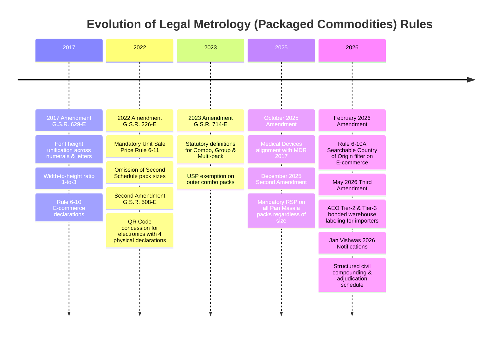
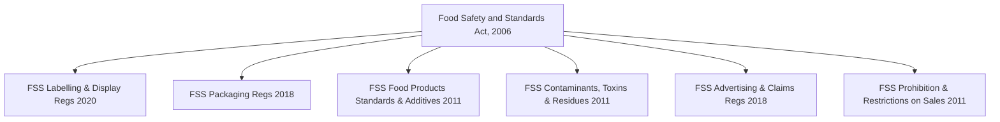

# STATUTORY, REGULATORY & ALGORITHMIC MASTER BLUEPRINT
## Automated Regulatory Compliance Verification System for Packaged Commodities & Food Safety
**Department of Consumer Affairs (DoCA) | Food Safety & Standards Authority of India (FSSAI) | Maharashtra State Authorities (Legal Metrology & FDA)**

---

## 1. LEGISLATIVE FOUNDATION & STATUTORY JURISDICTION

### 1.1 The Legal Metrology Act, 2009 (Act No. 1 of 2010)
Enacted by the Parliament of India to establish and enforce standards of weights and measures, regulate trade and commerce in pre-packaged commodities, and protect consumers against fraudulent gravimetric, volumetric, and pricing practices.

#### Core Statutory Sections:
*   **Section 18 (Mandatory Declarations on Pre-packaged Commodities):**
    *   *Section 18(1):* Prohibits manufacturing, packing, selling, importing, distributing, offering, exposing, or possessing for sale any pre-packaged commodity unless it conforms to standard quantities/numbers and bears all prescribed statutory markings and declarations.
    *   *Section 18(2):* Mandates that any retail advertisement (print, broadcast, digital) mentioning the retail sale price must explicitly declare the net quantity or number of the commodity contained in the package.
*   **Section 36 (Penal Provisions for Contravention of Section 18):**
    *   *Section 36(1) [Non-conforming net quantity or standard size]:* Fine up to ₹25,000 for the first offence; up to ₹50,000 for the second offence; and up to ₹1,00,000 or imprisonment up to one year, or both, for subsequent offences.
    *   *Section 36(2) [Missing or non-compliant statutory declarations]:* Fine up to ₹25,000 for the first offence; up to ₹50,000 for the second offence; and up to ₹1,00,000 or imprisonment up to one year, or both, for subsequent offences.
*   **Section 39 (Offences by Importers):** Imposes equivalent penal liability on entities importing non-compliant pre-packaged goods without mandatory declarations or valid registration.
*   **Section 48 (Compounding of Offences):** Empowers the Controller of Legal Metrology or designated state compounding officers to compound offences before or after prosecution upon payment of the compounding fee schedule.
*   **Section 49 (Offences by Companies & Vicarious Liability):** Mandates that companies nominate a specific director/manager responsible for metrological compliance. In the absence of a formal nomination under Section 49(2), every person in charge of and responsible to the company for the conduct of its business at the time of the offence is held personally liable.
*   **Jan Vishwas (Amendment of Provisions) Act, 2023 & 2026 Notifications:** Decriminalized initial, non-fraudulent metrological infractions by establishing structured civil adjudications and escalating administrative penalty schedules in lieu of criminal magistrate trials.

---

### 1.2 Legal Metrology (Packaged Commodities) Rules, 2011 (LMPC Rules, 2011)
Published vide G.S.R. 202(E) dated 7th March 2011, establishing the operational mechanics of consumer packaging compliance across India.

#### Master Rule Catalog:
*   **Rule 2 (Statutory Definitions):**
    *   *Rule 2(a) "Combination Package":* A package containing two or more individual products or units of different commodities (e.g., shaving razor + shaving foam; toothbrush + paste).
    *   *Rule 2(b) "Group Package":* A package intended for retail sale, containing two or more individual packages of the same or different commodities.
    *   *Rule 2(c) "Multi-piece Package":* A package containing two or more individually packaged or labeled pieces of the same commodity of identical quantity, intended for retail sale or consumption (e.g., 4 x 100g soap bars).
    *   *Rule 2(h) "Principal Display Panel" (PDP):* The total surface area of the package available for displaying statutory declarations.
    *   *Rule 2(l) "Retail Sale Price" (MRP):* The maximum price at which the commodity in packaged form may be sold to the consumer, inclusive of all taxes.
    *   *Rule 2(m) "Unit Sale Price" (USP):* The price per unit of measurement (per g, per kg, per ml, per L, per m, or per piece/unit).
*   **Rule 6 (Declarations to be Made on Every Package):**
    *   *Rule 6(1)(a):* Name and complete registered premises address of the manufacturer, packer, or importer, along with the Country of Origin for imported goods.
    *   *Rule 6(1)(b):* Generic or common name of the commodity.
    *   *Rule 6(1)(c):* Net quantity in standard SI metric units of mass, volume, length, or number.
    *   *Rule 6(1)(d):* Month and year of manufacture, packing, or import.
    *   *Rule 6(1)(e):* Maximum Retail Price (MRP) in Indian currency (`₹` or `Rs.`) inclusive of all taxes.
    *   *Rule 6(1)(f):* Consumer grievance redressal details (Designation, Address, Telephone, Email).
    *   *Rule 6(10):* Mandatory display of all statutory declarations on digital e-commerce marketplaces prior to consumer purchase.
    *   *Rule 6(10A) [2026 Amendment]:* Mandatory searchable and sortable filter based on Country of Origin on digital marketplace listings.
    *   *Rule 6(11):* Mandatory Unit Sale Price (USP) declarations rounded to two decimal places.
*   **Rule 7 & Table-I (Display Panel Geometry & Font Heights):** Establishes minimum font height thresholds ($1.0\text{ mm}$ to $6.0\text{ mm}$) based on the Principal Display Panel area ($A_{\text{pdp}}$) and mandates a minimum character width-to-height ratio of $1:3$ ($33.3\%$).
*   **Rule 8 (Conspicuousness and Contrast):** Declarations must be legible, definite, distinct, and prominent against the background substrate.
*   **Rule 9 (Language):** Hindi in Devanagari script or English.
*   **Rule 10 (Manner of Declaring Name and Address):** Full operational premises address with City, State, and 6-digit postal PIN code.
*   **Rules 11, 12, 13 (Metric Units & Prohibition of Vague Terms):** Prohibits uncertain words (*"when packed"*, *"approximate"*, *"colossal"*, *"jumbo"*) and non-standard symbols (`gms`, `kgs`, `ltrs`).
*   **Rule 18 (Retail Pricing Discipline):**
    *   *Rule 18(2):* Strict prohibition against selling pre-packaged goods at a price higher than the declared MRP.
    *   *Rule 18(5):* Strict prohibition against smudging, obliterating, altering, or pasting price stickers over the original MRP.
    *   *Anti-Dual MRP Doctrine:* Prohibits charging differential prices for identical packaged goods sold in cinema multiplexes, hotels, and airports.
*   **First Schedule:** Maximum Permissible Error (MPE) allowable in net quantity verification.
*   **Rule 26 (Statutory Exemptions):** Commodities $> 25\text{ kg}$ or $> 25\text{ L}$ (except cement and fertilizer bags up to $50\text{ kg}$); industrial and institutional consumers.
*   **Rule 27 (Mandatory Registration):** Compulsory registration of all manufacturers, packers, and importers with the Central Director or State Controller within 90 days.

---

### 1.3 Consolidated PCR Amendments Trajectory (2017 – 2026)



#### Detailed Breakdown of 2025 & 2026 Amendments:
1.  **PCR Amendment Rules, 2025 (October 2025) [Medical Devices]:**
    *   *Harmonization Clause:* Aligned the LMPC Rules with the **Medical Devices Rules, 2017** under the Drugs and Cosmetics Act.
    *   *Precedence Rule:* For notified medical devices, the font sizing, character dimensions, and labelling layouts prescribed under the Medical Devices Rules take precedence over Table-I of Rule 7.
    *   *PDP Exemption:* Declarations are not required strictly on the front PDP if they are displayed compliantly across the outer carton under the MDR framework.
2.  **PCR Second Amendment Rules, 2025 (December 2025) [Pan Masala Mandatory Declarations]:**
    *   *Removal of Small Pack Exemption:* Completely eliminated the historical exemption for packs measuring $\le 10\text{ g}$ or $\le 10\text{ cm}^3$ in respect of pan masala.
    *   *Mandatory RSP & Declarations:* Every single sachet or pack of pan masala, regardless of size or weight (even $0.5\text{ g}$ or $1\text{ g}$), must declare the Retail Sale Price (RSP), Net Quantity, Manufacturer details, Consumer Care, and statutory health warnings.
    *   *Effective Date:* **February 1, 2026**.
3.  **PCR Amendment Rules, 2026 (February 2026) [E-Commerce Searchable Origin Filter]:**
    *   *Rule 6(10A) Insertion:* Mandated that all e-commerce platforms and digital marketplaces operating in India selling imported goods must implement an automated, **searchable, and sortable filter based on Country of Origin**.
    *   *Consumer Choice Protection:* Enables Indian consumers to filter and sort products specifically by origin country prior to checkout.
    *   *Effective Date:* **July 1, 2026**.
4.  **PCR Third Amendment Rules, 2026 (May 2026) [AEO Bonded Warehouse Labeling]:**
    *   *Import Facilitation:* Authorized Economic Operator (AEO) Tier-2 and Tier-3 certified importers are permitted to affix mandatory Indian statutory labels (MRP, USP, Net Qty, Importer Details) at accredited bonded customs warehouses.
    *   *Customs Clearance Lock:* Mandatory declarations must be physically verified and affixed before goods leave the bonded customs perimeter.
5.  **Jan Vishwas (Amendment of Provisions) Act, 2026 Enforcement:**
    *   *Civil Adjudication Shift:* Minor first-time labelling infractions under Section 36(2) transitioned from criminal courts to administrative Adjudicating Officers (State Deputy/Joint Controllers).
    *   *Statutory Compounding Formula:* Implemented fixed compounding formulas based on product batch volume rather than arbitrary inspector discretion.

---

## 2. FOOD SAFETY & STANDARDS AUTHORITY OF INDIA (FSSAI) CORE STATUTES

For edible pre-packaged goods, the system enforces compliance with the **Food Safety and Standards Act, 2006 (Act No. 34 of 2006)** and its specialized regulations:



### 2.1 Food Safety and Standards Act, 2006 (FSSA, 2006)
*   **Section 3(1)(a) "Adulterant":** Any material which is or could be employed for making the food unsafe, sub-standard, or mis-branded.
*   **Section 3(1)(zf) "Misbranded Food":** Food manufactured, packed, or sold with false, misleading, or deceptive claims, or without statutory declarations regarding ingredients, net quantity, manufacturer address, and nutritional values.
*   **Section 3(1)(zx) "Unsafe Food":** Food whose nature, substance, or quality is so affected as to make it injurious to health through poisonous constituents, decomposition, unhygienic preparation, or pathogenic contamination.
*   **Section 23 (Packaging and Labelling):** No person shall manufacture, distribute, sell, or expose for sale pre-packaged food that is not marked and labelled in the manner specified by regulations.
*   **Section 24 (Advertising and Unfair Trade Practices):** Prohibits false or misleading advertisements and deceptive claims regarding the quality, nature, or nutritional efficacy of any food.
*   **Penal Sections:**
    *   *Section 51:* Penalty for sub-standard food (fine up to ₹5,00,000).
    *   *Section 52:* Penalty for misbranded food (fine up to ₹3,00,000).
    *   *Section 53:* Penalty for misleading advertisement / false claims (fine up to ₹10,00,000).
    *   *Section 54:* Penalty for food containing extraneous matter (fine up to ₹1,00,000).
    *   *Section 58:* Penalty for contraventions for which no specific penalty is provided (fine up to ₹2,00,000).
    *   *Section 59:* Punishment for unsafe food (imprisonment from 6 months up to life imprisonment and fine up to ₹10,00,000 depending on injury or death).
    *   *Section 63:* Punishment for carrying on food business without FSSAI License/Registration (imprisonment up to 6 months and fine up to ₹5,00,000).

---

### 2.2 FSS (Labelling and Display) Regulations, 2020
*   **Regulation 5(1):** General requirements (legibility, language in English or Hindi, indelible printing).
*   **Regulation 5(2):** FSSAI Logo and 14-digit License Number prominently displayed on the label with contrasting background.
*   **Regulation 5(3):** Mandatory Nutritional Facts per $100\text{ g}$ or $100\text{ ml}$ AND per single metric serve with % contribution to Recommended Dietary Allowances (RDA) based on a 2000 kcal diet:
    1. Energy Value ($\text{kcal}$)
    2. Protein ($\text{g}$)
    3. Carbohydrates ($\text{g}$), Total Sugars ($\text{g}$), Added Sugars ($\text{g}$)
    4. Total Fat ($\text{g}$), Saturated Fat ($\text{g}$), Trans Fat ($\text{g}$) (trans fat must not exceed $2\%$ of total fats)
    5. Cholesterol ($\text{mg}$)
    6. Sodium ($\text{mg}$)
*   **Regulation 5(4):** Dietary Iconography:
    *   *Vegetarian Food:* Green filled circle inside green square outline.
    *   *Non-Vegetarian Food:* Brown filled equilateral triangle inside brown square outline.
    *   *Vegan Food:* Green letter **V** with leaf motif inside square and word **"VEGAN"** below.
    *   *Dimensional Standards:* Minimum diameter $3\text{ mm}$ ($A_{\text{pdp}} \le 100\text{ cm}^2$), $4\text{ mm}$ ($100-500\text{ cm}^2$), $6\text{ mm}$ ($500-2500\text{ cm}^2$), $8\text{ mm}$ ($> 2500\text{ cm}^2$).
*   **Regulation 5(5):** Mandatory Allergen Declaration: 8 major food allergens must be declared in **bold** in the ingredient list or in an adjacent callout box:
    1. Cereals containing gluten (wheat, rye, barley, oats, spelt)
    2. Crustaceans and products thereof
    3. Eggs and egg products
    4. Fish and fish products
    5. Peanuts, tree nuts, and products thereof
    6. Soybeans and products thereof
    7. Milk and milk products
    8. Sulphite in concentrations $\ge 10\text{ mg/kg}$
*   **Regulation 5(6):** Date marking: Date of Manufacture/Packing and Expiry Date / Use by Date must be **grouped together in one place** on the packaging.

---

### 2.3 FSS (Packaging) Regulations, 2018
*   **Food Grade Contact Materials:** All packaging materials coming into direct contact with food must be of food-grade quality and comply with Indian Standards (IS) specifications listed in Schedules I, II, and III.
*   **Overall Migration Limit (OML):** Plastic food contact materials must not release non-volatile substances exceeding **$60\text{ mg/kg}$ or $10\text{ mg/dm}^2$** into food simulant substances under prescribed testing conditions.
*   **Heavy Metal Migration Limits:** Leachable concentrations must not exceed:
    *   Lead ($Pb$): $0.01\text{ mg/kg}$
    *   Cadmium ($Cd$): $0.01\text{ mg/kg}$
    *   Chromium ($Cr$): $0.05\text{ mg/kg}$
*   **Printing Ink Standards (IS 15495):** Printing inks must be non-hazardous and formulated without toluene, lead, or toxic solvents. Inks must **NEVER come into direct contact with food**.
*   **Absolute Prohibition on Newspapers:** Strict, non-negotiable ban on using printing newspapers, recycled waste paper, or uncertified cardboard for wrapping, packing, storing, or absorbing oil from food items.
*   **Recycled Plastics Ban:** Use of post-consumer recycled plastics in direct food contact is strictly prohibited unless processed through an FSSAI-approved food-grade recycling decontamination protocol.

---

### 2.4 FSS (Food Products Standards & Food Additives) Regulations, 2011
*   **Vertical Product Standards:** Prescribes composition, moisture, ash, acidity, and refractive index standards for Dairy, Fats/Oils, Fruits/Vegetables, Cereals/Pulses, Meat/Fish, Sweets/Confectionery, and Beverages.
*   **Food Additives Framework (Appendices A and B):** Only additives explicitly approved under the Codex/FSSAI positive list with assigned International Numbering System (INS) numbers may be utilized within prescribed Good Manufacturing Practice (GMP) or numerical maximum permissible limits (ppm).
*   **Prohibited Additives:**
    *   Potassium Bromate and Potassium Iodate prohibited in bread and bakery manufacturing.
    *   Prohibition of non-permitted synthetic chemical dyes (e.g., Metanil Yellow, Sudan dyes, Rhodamine B, Auramine, Orange II).
    *   Artificial sweeteners prohibited in infant foods and foods not explicitly authorized under Appendix A.

---

### 2.5 FSS (Contaminants, Toxins & Residues) Regulations, 2011
*   **Heavy Metal Tolerances:**
    *   Lead ($Pb$): Max $0.1\text{ mg/kg}$ to $2.5\text{ mg/kg}$ depending on food category.
    *   Arsenic ($As$): Max $0.1\text{ mg/kg}$ to $1.1\text{ mg/kg}$.
    *   Cadmium ($Cd$): Max $0.05\text{ mg/kg}$ to $1.5\text{ mg/kg}$.
    *   Mercury ($Hg$): Max $0.5\text{ mg/kg}$ to $1.0\text{ mg/kg}$ (Methyl mercury in fish).
    *   Tin ($Sn$): Max $250\text{ mg/kg}$ in canned foods.
*   **Mycotoxins & Natural Toxins:**
    *   Aflatoxin ($B_1 + B_2 + G_1 + G_2$): Max $15\text{ mcg/kg}$ ($\mu\text{g/kg}$) in nuts, cereals, and spices.
    *   Aflatoxin $M_1$: Max $0.5\text{ mcg/kg}$ in milk.
    *   Ochratoxin A: Max $5.0\text{ mcg/kg}$ in wheat, barley, rye, coffee.
    *   Patulin: Max $50\text{ mcg/kg}$ in apple juice and apple products.
*   **Pesticide Residues & Maximum Residue Limits (MRLs):** Enforces analytical limits for organochlorines, organophosphates, carbamates, and synthetic pyrethroids.
*   **Antibiotic and Veterinary Drug Residues:** Strict zero-tolerance or prescribed maximum residue limits in poultry, fish, meat, and honey.

---

### 2.6 FSS (Advertising & Claims) Regulations, 2018 & Recent Directives
*   **Protected Term Criteria (Schedule I & II):**
    *   *"Natural":* Allowed ONLY if food is single-ingredient, unprocessed, and free from added chemical additives or synthetic colorings.
    *   *"Fresh":* Allowed ONLY for raw, unprocessed agricultural produce; prohibited on canned, dried, reconstituted, or chemically preserved items.
    *   *"Pure":* Allowed ONLY when no additives, preservatives, or other ingredients have been blended.
    *   *"Traditional" / "Authentic":* Requires verifiable geographical heritage or documented recipe methodology.
*   **FSSAI 2024 Directives on Misleading Claims:**
    *   *Ban on "100% Fruit Juice":* FBOs must remove "100% Fruit Juice" claims on reconstituted fruit juices prepared from fruit concentrate and water.
    *   *Prohibition of "ORS" Branding:* Non-medicinal ready-to-drink beverages are prohibited from using the term "ORS" or similar phonetic brand names to prevent misleading patients.
    *   *De-categorization of "Health Drink":* Malt-based beverages cannot be marketed or indexed under "Health Drink" or "Energy Drink" categories on e-commerce platforms.

---

### 2.7 FSS (Prohibition & Restrictions on Sales) Regulations, 2011
*   **Prohibition of Admixtures:** Prohibits selling admixtures of two or more edible vegetable oils unless sold as "Blended Edible Vegetable Oil" certified by AGMARK and complying with Regulation 2.1.4.
*   **Prohibition of Loose Edible Oil (Regulation 2.3.15):** Strictly prohibits the sale of loose, unsealed, or unbranded edible vegetable oils.
*   **Khesari Dal Prohibition:** Strict prohibition on the sale, storage, or blending of Khesari gram (*Lathyrus sativus*) or Khesari flour, with a narrow tolerance of **$\le 2\%$ by mass** for accidental, incidental weed presence in whole pulses.
*   **Prohibition of Milk Adulterants:** Prohibits sale of milk containing added water, detergents, starch, urea, or unapproved preservatives.
*   **Meat Processing Safeguards:** Prohibits sale of meat or poultry obtained from animals not slaughtered in licensed and inspected abattoirs.

---

## 3. THE 16 OFFICIAL FOOD SAFETY & METROLOGY VIOLATION CATEGORIES

The system implements the definitive, 16-category ontology utilized by the **National Consumer Helpline (NCH)**, **FSSAI Food Safety Connect**, and **Maharashtra State Legal Metrology (eMaap)**:

```
+----------------------------------------------------------------------------------------------------+
|                         OFFICIAL VIOLATION & GRIEVANCE TAXONOMY (16 PILLARS)                       |
+------------------------------------+-----------------------------------+---------------------------+
| 1.  FOOD_ADULTERATION              | 7.  MISSING_LABEL_DECLARATION     | 13. ALLERGEN_DECLARATION  |
| 2.  UNSAFE_FOOD                    | 8.  WRONG_NET_QUANTITY            | 14. FSSAI_INFORMATION     |
| 3.  SPOILED_FOOD                   | 9.  MRP_ISSUE                     | 15. UNLICENSED_BUSINESS   |
| 4.  CONTAMINATION                  | 10. EXPIRY_DATE_ISSUE             | 16. OTHER_FOOD_SAFETY     |
| 5.  HYGIENE_PROBLEM                | 11. PACKAGING_ISSUE               |                           |
| 6.  MISLEADING_LABEL               | 12. INGREDIENT_DISCLOSURE         |                           |
+------------------------------------+-----------------------------------+---------------------------+
```

### In-Depth Analysis of Each Category:

#### Category 1: `FOOD_ADULTERATION`
*   **Statutory Definition:** Addition of inferior, cheaper, or toxic substances to food, or abstraction of essential nutritive constituents, compromising the natural substance and quality (FSSA 2006 Sec 3(1)(a) & Sec 51/54).
*   **Specific Legal Clauses Violated:** FSSA 2006 Sec 26, Sec 27, Sec 51; FSS (Prohibition and Restrictions on Sales) Regulations, 2011 Reg 2.1.1.
*   **Field & Automated AI Detection Indicators:**
    *   Chemical/spectroscopic lab test report ingestion (e.g., Fourier-transform infrared or mass-spec results).
    *   OCR ingredient check: Presence of unauthorized non-permitted substances (e.g., starch in paneer, urea/detergent in milk, chalk in flour).
    *   Oil blending flags: Single-source oil declaring multiple vegetable oil sources without "Blended Edible Vegetable Oil" classification.
*   **Evidentiary Standard & Thresholds:** Detection of any synthetic dye, banned vegetable fat, or foreign substance exceeding 0% tolerance.
*   **Statutory Penalties:** Sub-standard food: fine up to ₹5,00,000; Unsafe adulteration: imprisonment from 6 months to life imprisonment + fine up to ₹10,00,000 (Sec 59).
*   **Grievance & Enforcement Routing:** Escalated to Designated Officer (DO) / Food Safety Officer (FSO) for sample seizure under Section 38.

---

#### Category 2: `UNSAFE_FOOD`
*   **Statutory Definition:** Food whose composition, microbial load, or chemical toxicity makes it injurious to human health or unfit for human consumption (FSSA 2006 Sec 3(1)(zx)).
*   **Specific Legal Clauses Violated:** FSSA 2006 Sec 26(1), Sec 27(1), Sec 59.
*   **Field & Automated AI Detection Indicators:**
    *   Lab assay indicating microbial counts exceeding FSSAI limits (e.g., *Salmonella*, *Listeria monocytogenes*, *E. coli*).
    *   Toxin levels exceeding permissible limits (e.g., Aflatoxins $> 15\text{ ppb}$).
    *   Physical hazard detection from image uploads (glass, sharp metal, dead insects).
*   **Evidentiary Standard & Thresholds:** Positive identification of pathogens, severe chemical toxins, or physical hazardous foreign objects.
*   **Statutory Penalties:** Non-fatal injury: imprisonment 1 to 6 years + fine up to ₹3,00,000; Grievous injury: 6 years to life + fine up to ₹5,00,000; Death: 7 years to life imprisonment + fine $\ge$ ₹10,00,000.
*   **Grievance & Enforcement Routing:** Priority 1 Red Alert: Instant SMS/Email dispatch to Commissioner of Food Safety and immediate product recall under FSS (Food Recall Procedure) Regulations, 2017.

---

#### Category 3: `SPOILED_FOOD`
*   **Statutory Definition:** Food that has undergone natural decomposition, rancidity, putrefaction, fermentation, or decay rendering it organoleptically or biologically unacceptable (FSSA 2006 Sec 3(1)(zx)(iii)).
*   **Specific Legal Clauses Violated:** FSSA 2006 Sec 26(2)(i), Sec 59.
*   **Field & Automated AI Detection Indicators:**
    *   Computer vision inspection of consumer-uploaded photos: Visible mold mycelium, fungal growth, bacterial slime, discoloration, curdling, or bloated/swollen cans (clostridium botulinum gas production).
    *   Rancidity indicators from inspection logs (Peroxide Value $> 10\text{ meq/kg}$, Free Fatty Acids $> 1.5\%$).
*   **Evidentiary Standard & Thresholds:** Visible spoilage on image or sensory assay verification by accredited food laboratory.
*   **Statutory Penalties:** Confiscation of batch + penalty up to ₹1,00,000 to ₹3,00,000 under Section 54/58.
*   **Grievance & Enforcement Routing:** Local FSO inspection dispatched to retail warehouse/store.

---

#### Category 4: `CONTAMINATION`
*   **Statutory Definition:** Presence of chemical, radiological, metallic, or foreign matter not intentionally added, entering food during production, packaging, transport, or holding (FSSA 2006 Sec 21).
*   **Specific Legal Clauses Violated:** FSS (Contaminants, Toxins and Residues) Regulations, 2011; FSSA 2006 Sec 54.
*   **Field & Automated AI Detection Indicators:**
    *   Metal detector logs / X-ray scanner image validation.
    *   Heavy metal testing exceeding statutory limits (Lead $> 2.5\text{ ppm}$, Arsenic $> 1.1\text{ ppm}$).
    *   High pesticide MRL exceedance in agricultural commodities.
*   **Evidentiary Standard & Thresholds:** Quantitative chemical analysis exceeding maximum permissible limits in FSS Contaminant Regulations.
*   **Statutory Penalties:** Penalty up to ₹1,00,000 (extraneous matter) to ₹5,00,000 (sub-standard/unsafe).
*   **Grievance & Enforcement Routing:** FSSAI FoSCoS grievance queue with mandatory batch recall order.

---

#### Category 5: `HYGIENE_PROBLEM`
*   **Statutory Definition:** Unsanitary, unhygienic, or filthy conditions during processing, packaging, storage, or distribution creating severe risk of contamination (FSSA 2006 Sec 56).
*   **Specific Legal Clauses Violated:** FSSA 2006 Sec 56; Schedule 4 of FSS (Licensing and Registration of Food Businesses) Regulations, 2011.
*   **Field & Automated AI Detection Indicators:**
    *   Premises audit image processing: Open drains, pest infestation, lack of insect screens, staff without hairnets/gloves, garbage proximity.
    *   Water potability test failures (presence of coliform bacteria in processing water).
*   **Evidentiary Standard & Thresholds:** Objective non-conformity with Schedule 4 Sanitary and Hygienic Requirements.
*   **Statutory Penalties:** Penalty up to ₹1,00,000 + suspension or cancellation of FSSAI License until re-inspection clearance.
*   **Grievance & Enforcement Routing:** Dispatched to municipal health department / local food safety inspectorate.

---

#### Category 6: `MISLEADING_LABEL`
*   **Statutory Definition:** False, deceptive, or unsubstantiated descriptions, claims, or visual illustrations regarding nature, identity, composition, origin, or health efficacy (FSSA Sec 24 & Sec 53; LMPC Rule 13(5)).
*   **Specific Legal Clauses Violated:** FSS (Advertising and Claims) Regulations, 2018; FSS Labelling Regs 2020 Reg 4; LMPC Rules 2011 Rule 13; Consumer Protection Act, 2019 Sec 2(28).
*   **Field & Automated AI Detection Indicators:**
    *   *Claim Extractor NLP:* Flags *"100% Pure Fruit Juice"* when ingredient list declares water and reconstituted concentrate.
    *   *Protected Keyword Auditor:* Flags *"Natural"*, *"Fresh"*, *"Pure"* on products with synthetic preservatives (INS 211, INS 202) or synthetic colors.
    *   *Health Claim Checker:* Flags unapproved disease risk claims (e.g., *"Cures Diabetes"*, *"Prevents Cancer"*).
    *   *Visual Deception:* Illustrations of luscious fresh fruits on synthetic flavored confectionery containing 0% fruit pulp.
*   **Evidentiary Standard & Thresholds:** Textual discrepancy between label claims and laboratory or ingredient reality.
*   **Statutory Penalties:** Fine up to ₹10,00,000 under FSSA Section 53; compounding under Legal Metrology Act Section 48.
*   **Grievance & Enforcement Routing:** Central Consumer Protection Authority (CCPA) and FSSAI Claims Scrutiny Committee.

---

#### Category 7: `MISSING_LABEL_DECLARATION`
*   **Statutory Definition:** Absence of any statutory declaration mandated by law on the Principal Display Panel or secondary label panels (LMPC Rule 6; FSS Labelling Regs 2020 Reg 5).
*   **Specific Legal Clauses Violated:** LMPC Rules, 2011 Rule 6(1)(a)-(f); FSS (Labelling and Display) Regulations, 2020 Reg 5; LM Act 2009 Sec 18 & Sec 36(2).
*   **Field & Automated AI Detection Indicators:**
    *   Computer vision verification checks the existence of:
        1. Manufacturer/Packer identity & registered premises address.
        2. Country of Origin.
        3. Common / Generic name.
        4. Net quantity in standard SI units.
        5. Retail Sale Price (MRP incl. of all taxes).
        6. Unit Sale Price (USP).
        7. Date of manufacture/packing.
        8. Consumer Care contact info.
    *   Flags missing fields as **CRITICAL STATUTORY NON-COMPLIANCE**.
*   **Evidentiary Standard & Thresholds:** Absence of any 1 of the 8 mandatory LMPC declarations or mandatory FSSAI panels.
*   **Statutory Penalties:** Legal Metrology: ₹25,000 (first) / ₹50,000 (second) / ₹1,00,000 or 1 yr jail (subsequent); FSSA: Fine up to ₹3,00,000 for misbranding (Sec 52).
*   **Grievance & Enforcement Routing:** Automated Seizure Memo (Form 1) generation for Legal Metrology Inspectorate.

---

#### Category 8: `WRONG_NET_QUANTITY`
*   **Statutory Definition:** Declarations of weight, volume, or count that fail to conform to standard SI units, or physical contents falling short of declared quantity beyond Maximum Permissible Error (MPE) (LMPC Rules 11, 12, 13 & First Schedule).
*   **Specific Legal Clauses Violated:** LMPC Rules, 2011 Rule 6(1)(c), Rules 11–13, First Schedule; LM Act 2009 Sec 36(1).
*   **Field & Automated AI Detection Indicators:**
    *   *Unit Syntax OCR:* Flags non-standard symbols (`gms`, `kgs`, `ltr`, `m.l.`, `kilos`).
    *   *Vague Expressions:* Flags qualifying terms (`approx`, `when packed`, `minimum net weight`).
    *   *Gravimetric Deficit Calculator:*
        $$\text{Deficit} = Q_{\text{declared}} - Q_{\text{measured}}$$
        Compares measured deficiency against First Schedule MPE table.
*   **Evidentiary Standard & Thresholds:** Short delivery exceeding MPE (e.g. $> 9\%$ for packs $\le 50\text{ g}$, or $> 15\text{ g}$ for packs $500-1000\text{ g}$).
*   **Statutory Penalties:** Fine up to ₹25,000 (first offence) to ₹1,00,000 or 1 year imprisonment under Section 36(1).
*   **Grievance & Enforcement Routing:** State Controller of Legal Metrology inspection drive + confiscation of non-compliant lot.

---

#### Category 9: `MRP_ISSUE`
*   **Statutory Definition:** Overcharging above printed MRP, printing multiple/dual MRPs for identical products, omitting "(inclusive of all taxes)", or altering/pasting stickers over the original MRP (LMPC Rule 6(1)(e), Rule 18(2), Rule 18(5)).
*   **Specific Legal Clauses Violated:** LMPC Rules, 2011 Rule 6(1)(e), Rule 18(2), Rule 18(5); Consumer Protection Act, 2019 Sec 2(47).
*   **Field & Automated AI Detection Indicators:**
    *   *Sticker Detection CV Model:* Identifies paper overlay sticker edge contours, texture divergence, and height displacement over the MRP area.
    *   *MRP Syntax Parser:* Flags absence of `(incl. of all taxes)` or `inclusive of all taxes`.
    *   *Dual MRP Scanner:* Compares identical SKU listings across locations (multiplexes, airports vs general trade).
    *   *Receipt Auditing OCR:* Cross-checks retail POS invoice price against printed package MRP; flags any markup $\ge ₹0.01$.
*   **Evidentiary Standard & Thresholds:** Proof of secondary sticker over MRP, missing tax statement, or retail cash receipt exceeding printed MRP.
*   **Statutory Penalties:** Fine up to ₹25,000 to ₹50,000 under Section 36(2) and Section 39; prosecution under Rule 18(2).
*   **Grievance & Enforcement Routing:** National Consumer Helpline (NCH) + State Legal Metrology Enforcement Squad.

---

#### Category 10: `EXPIRY_DATE_ISSUE`
*   **Statutory Definition:** Selling, distributing, or storing pre-packaged food beyond its declared "Expiry Date" or "Use by Date", or obliterating/tampering with date stamps (FSS Labelling Regs 2020 Reg 5(6); LMPC Rule 6(1)(d)).
*   **Specific Legal Clauses Violated:** FSSA 2006 Sec 26(2)(iv), Sec 27(1), Sec 59; LMPC Rules Rule 6(1)(d).
*   **Field & Automated AI Detection Indicators:**
    *   *Temporal Math Engine:*
        $$\Delta t = \text{Current Date} - \text{Declared Expiry Date}$$
        If $\Delta t > 0$, flags **EXPIRED PRODUCT OFFERED FOR SALE (CRITICAL DANGER)**.
    *   *Spatial Proximity Checker:* Verifies Date of Mfg and Expiry Date are grouped together in one location.
    *   *Tamper Detection CV:* Identifies dot-matrix inkjet smudging, re-stamping, or erasure marks on expiry date panel.
*   **Evidentiary Standard & Thresholds:** Transaction timestamp or inspection timestamp occurring after the declared calendar expiry date.
*   **Statutory Penalties:** Selling expired food is treated as selling unsafe/substandard food: fine up to ₹3,00,000 to ₹5,00,000 + immediate stock seizure and destruction.
*   **Grievance & Enforcement Routing:** Urgent dispatch to local Food Safety Officer for spot seizure and destruction under Section 38.

---

#### Category 11: `PACKAGING_ISSUE`
*   **Statutory Definition:** Utilizing non-food-grade packaging, unapproved recycled plastics, printing ink touching food, printed newspaper wrapping, or physically compromised packaging leaking or exposed to atmosphere (FSS Packaging Regs 2018).
*   **Specific Legal Clauses Violated:** FSS (Packaging) Regulations, 2018 Reg 3, Reg 4; FSSA 2006 Sec 23.
*   **Field & Automated AI Detection Indicators:**
    *   *Newspaper Classifier CV:* Image recognition model detecting newspaper print, headlines, or non-food grade unprinted recycled kraft paper touching food.
    *   *Packaging Integrity Checker:* Detects punctures, tears, compromised heat-seals, dented tin cans, or damaged tamper-evident bands.
    *   *Plastic Symbol Scanner:* Verifies presence of food contact "Fork and Wineglass" symbol and standard resin identification codes (1 to 7).
*   **Evidentiary Standard & Thresholds:** Photographic proof of newspaper food contact, migration test failure ($> 60\text{ mg/kg}$ OML), or torn packaging seal.
*   **Statutory Penalties:** Penalty up to ₹2,00,000 under Section 58; cancellation of registration.
*   **Grievance & Enforcement Routing:** FSSAI State Enforcement Cell & Municipal Hygiene Squad.

---

#### Category 12: `INGREDIENT_DISCLOSURE`
*   **Statutory Definition:** Omission of a complete, truthful ingredient list in descending order of in-going weight/volume, or failing to declare food additives by their functional classes and INS numbers (FSS Labelling Regs 2020 Reg 5(1)).
*   **Specific Legal Clauses Violated:** FSS (Labelling and Display) Regulations, 2020 Reg 5(1), Reg 5(2); FSSA 2006 Sec 52.
*   **Field & Automated AI Detection Indicators:**
    *   *Descending Order Validator:* Evaluates whether compound ingredients list individual components in brackets.
    *   *Additive Parser:* Verifies that food additives declare both functional class name and INS number (e.g., *"Preservative (INS 211)"*, *"Acidity Regulator (INS 330)"*).
    *   *E-Number Cross-Reference:* Matches declared E/INS numbers against the FSSAI approved food additive positive list in Appendix A.
*   **Evidentiary Standard & Thresholds:** Undeclared additives detected via lab testing, or missing ingredient list on multi-ingredient foods.
*   **Statutory Penalties:** Fine up to ₹3,00,000 for misbranding under Section 52.
*   **Grievance & Enforcement Routing:** FSSAI Registration / Licensing Compliance Division.

---

#### Category 13: `ALLERGEN_DECLARATION`
*   **Statutory Definition:** Failure to declare the presence of any of the 8 specified major food allergens in bold typeface in the ingredient list or in an explicit, prominent allergen callout box (FSS Labelling Regs 2020 Reg 5(5)).
*   **Specific Legal Clauses Violated:** FSS (Labelling and Display) Regulations, 2020 Regulation 5(5); FSSA 2006 Sec 23, Sec 52.
*   **Field & Automated AI Detection Indicators:**
    *   *Allergen NLP Lexicon Matcher:* Scans ingredient text for tokens matching the 8 allergen classes:
        - `gluten`, `wheat`, `barley`, `oats`, `spelt`
        - `crustacean`, `shrimp`, `prawn`, `crab`, `lobster`
        - `egg`, `albumen`, `egg yolk`
        - `fish`, `gelatin (fish)`
        - `peanut`, `groundnut`, `almond`, `cashew`, `walnut`, `hazelnut`, `pistachio`
        - `soy`, `soybean`, `soya`
        - `milk`, `whey`, `casein`, `lactose`
        - `sulphite`, `sulfite` ($\ge 10\text{ ppm}$)
    *   *Bold / Box Detector:* Verifies that identified allergen words carry bold font styling or appear inside `Contains: [Allergens]` text block.
*   **Evidentiary Standard & Thresholds:** Detection of allergen ingredients on label or in lab assays without corresponding bold or callout box disclosure.
*   **Statutory Penalties:** Fine up to ₹3,00,000 for misbranding; potential recall if life-threatening allergen risk exists.
*   **Grievance & Enforcement Routing:** FSSAI Consumer Grievance Portal (Allergen Taskforce).

---

#### Category 14: `FSSAI_INFORMATION`
*   **Statutory Definition:** Displaying an invalid, forged, unreadable, expired, or non-conforming FSSAI logo and 14-digit license/registration number on the label (FSS Labelling Regs 2020 Reg 5(2)).
*   **Specific Legal Clauses Violated:** FSS (Labelling and Display) Regulations, 2020 Reg 5(2); FSS (Licensing and Registration) Regulations, 2011.
*   **Field & Automated AI Detection Indicators:**
    *   *FSSAI Logo Object Detector:* Locates official FSSAI logotype.
    *   *License Number Syntax & Regex:*
        `(?i)lic\.?\s*(no\.?|number)?\s*[:\.]?\s*([1-2][0-9]{13})`
    *   *Structural Checksum & Taxonomy:*
        - Digit 1: `1` (License) or `2` (Registration)
        - Digits 2-3: State code (e.g. `15` for Maharashtra)
        - Digits 4-5: Year of registration (e.g. `24` for 2024)
        - Digits 6-8: Officer jurisdiction
        - Digits 9-14: Enterprise sequential ID
    *   *Live FoSCoS API Verification:* Pings FSSAI FoSCoS database to verify license validity, active status, business name, and premise address matching.
*   **Evidentiary Standard & Thresholds:** Absence of 14-digit number, failed checksum/format, or FoSCoS status showing `CANCELLED` / `EXPIRED` / `NON-EXISTENT`.
*   **Statutory Penalties:** Misbranding penalty up to ₹3,00,000 (Sec 52); Operating under forged license: criminal forgery + Sec 63.
*   **Grievance & Enforcement Routing:** Direct sync with FSSAI FoSCoS portal & State Licensing Authority.

---

#### Category 15: `UNLICENSED_FOOD_BUSINESS`
*   **Statutory Definition:** Manufacturing, storing, packaging, importing, distributing, or selling any food product without holding a valid, active FSSAI License or Registration (FSSA 2006 Sec 31 & Sec 63).
*   **Specific Legal Clauses Violated:** Food Safety and Standards Act, 2006 Section 31(1), Section 63.
*   **Field & Automated AI Detection Indicators:**
    *   Package completely lacks any FSSAI license number.
    *   Declared license number does not exist on FoSCoS registry.
    *   FoSCoS registry query reveals license was revoked or surrendered prior to product manufacturing date.
*   **Evidentiary Standard & Thresholds:** Verified absence of an active license on the FoSCoS central registry for the manufacturing entity.
*   **Statutory Penalties:** Imprisonment up to 6 months AND fine up to ₹5,00,000 under Section 63.
*   **Grievance & Enforcement Routing:** Immediate closure notice + criminal complaint filed by Designated Officer (DO).

---

#### Category 16: `OTHER_FOOD_SAFETY`
*   **Statutory Definition:** Residual food safety, deceptive practice, or public health violation not encapsulated in Categories 1–15, including state-specific contraband bans, misleading surrogate ads, or non-compliant digital marketplace practices.
*   **Specific Legal Clauses Violated:** Maharashtra State Gazettes under FSSA Sec 30(2)(a); Consumer Protection (E-Commerce) Rules, 2020; FSS (Packaging and Labelling) residual clauses.
*   **Field & Automated AI Detection Indicators:**
    *   *Maharashtra Gutkha/Pan Masala Scanner:* Matches banned keywords (`gutkha`, `pan masala`, `scented supari`) under Maharashtra Section 30(2)(a) annual prohibitions.
    *   *Digital Dark Patterns:* E-commerce checkout baskets auto-adding non-consensual items or withholding return policies on perishable foods.
    *   *Water & Ice Auditing:* Industrial ice or uncertified packaged drinking water sold without ISI/BIS mark (IS 14543 / IS 13428).
*   **Evidentiary Standard & Thresholds:** Breach of specific executive gazettes or cross-regulatory consumer protection directives.
*   **Statutory Penalties:** Immediate police seizure under Section 30/59; penalties under Consumer Protection Act, 2019.
*   **Grievance & Enforcement Routing:** Joint Taskforce (FDA Maharashtra + State Police + Central CCPA).

---

## 4. MAHARASHTRA STATE JURISPRUDENTIAL DIRECTIVES & ENFORCEMENT PROTOCOLS

### 4.1 Maharashtra Legal Metrology Department (Vaidhanik Mapan Shastra)
Headquartered at the Controller of Legal Metrology office, World Trade Centre, Cuffe Parade / Bandra Kurla Complex, Mumbai:

#### Division Jurisdictions:
1. **Mumbai Division** (Mumbai City, Mumbai Suburban)
2. **Konkan Division** (Thane, Palghar, Raigad, Ratnagiri, Sindhudurg)
3. **Pune Division** (Pune, Satara, Solapur, Kolhapur, Sangli)
4. **Nashik Division** (Nashik, Ahmednagar, Jalgaon, Dhule, Nandurbar)
5. **Chhatrapati Sambhajinagar (Aurangabad) Division** (Aurangabad, Jalna, Beed, Parbhani, Nanded, Osmanabad, Latur, Hingoli)
6. **Amravati Division** (Amravati, Akola, Yavatmal, Buldhana, Washim)
7. **Nagpur Division** (Nagpur, Wardha, Bhandara, Gondia, Chandrapur, Gadchiroli)

#### State Enforcement Mechanics & eMaap Integration:
*   **eMaap Portal (`emaap.gov.in`):** The automated software system generates digital dossiers formatted specifically to export via REST API into Maharashtra’s official inspection and license system.
*   **Seizure Memo (Form 1 / Form 2):** Generated under Section 15 of the Act read with Rule 29 of the Maharashtra Legal Metrology (Enforcement) Rules, 2011. Automatically populates:
    - Inspection location, GPS coordinates, and merchant commercial details.
    - Exact SKUs seized, lot numbers, nominal net quantities, and measured values.
    - Specific LMPC violation clauses and compounding fees calculable under Section 48.
*   **Anti-Dual MRP Jurisprudence:** The Bombay High Court and Maharashtra State Consumer Commission strictly enforce the ban on dual pricing. Packaged drinking water, snacks, and carbonated beverages sold in multiplexes, sports stadiums, luxury restaurants, and airports cannot have a different or higher MRP than identical SKUs sold in general retail.

---

### 4.2 Food & Drug Administration (FDA) Maharashtra Directives
Headquartered at Survey No. 341, Bandra Kurla Complex (BKC), Bandra (East), Mumbai:

#### Key State Enforcement Directives:
1.  **Section 30(2)(a) Prohibition on Gutkha & Scented Tobacco/Supari:**  
    Enacted annually by the Commissioner of Food Safety, Maharashtra. Strictly prohibits the manufacture, storage, distribution, transport, and sale of:
    - Gutkha
    - Pan Masala containing tobacco or nicotine
    - Flavored/scented tobacco
    - Flavored/scented supari (betel nut)
    - Any preparation containing tobacco, nicotine, or magnesium carbonate as ingredients.  
    *Enforcement:* The software treats any occurrence of these commodities as **PROHIBITED CONTRABAND**, generating an immediate criminal alert.
2.  **Strict Ban on Loose Edible Vegetable Oil (Regulation 2.3.15):**  
    Prohibits sale of loose edible oils in retail shops. All edible oil sold in Maharashtra must be in sealed packages bearing:
    - FSSAI License Number
    - AGMARK certification (where applicable)
    - Full nutritional panel with Trans Fat $< 2\%$
    - Mandatory tamper-evident closure
3.  **Mandatory "Best Before Date" on Sweetmeats (Mithai):**  
    FDA Maharashtra mandates that all retail sweet shops and pre-packaged mithai manufacturers must prominently display the "Date of Manufacture" and "Best Before Date" on packaging and display counter trays.

---

## 5. TECHNICAL & AI ARCHITECTURE SPECIFICATION

```
+──────────────────────────────────────────────────────────────────────────────────────────────────+
|                                    MULTI-MODAL INGESTION LAYER                                    |
|   • Mobile Native Camera Scanner (Flutter / React Native)                                        |
|   • Web Inspection Portal (FastAPI + React Dashboard)                                            |
|   • E-Commerce Marketplace Crawlers (Playwright / BeautifulSoup - Amazon, Flipkart, Blinkit)     |
+──────────────────────────────────────────────────────────────────────────────────────────────────+
                                                 │
                                                 ▼
+──────────────────────────────────────────────────────────────────────────────────────────────────+
|                              COMPUTER VISION & GEOMETRIC CALIBRATION                             |
|   1. 3D Surface Dewarping: Thin Plate Spline / Cylindrical Unrolling (Cans, Bottles, Pouches)   |
|   2. Homography Alignment: 4-point corner detection and perspective orthorectification          |
|   3. PDP Area Segmentation: Polygon mask area computation ($A_{\text{pdp}}$ in $\text{cm}^2$)   |
|   4. DPI / Spatial Calibration: Calibration via reference objects or hardware sensor data        |
+──────────────────────────────────────────────────────────────────────────────────────────────────+
                                                 │
                                                 ▼
+──────────────────────────────────────────────────────────────────────────────────────────────────+
|                           DEEP FEATURE EXTRACTION & OCR ENSEMBLE                                 |
|   • Dual-Engine OCR: PaddleOCR v4 (tabular/curved text) + TrOCR / Gemini Vision (fine print)     |
|   • Bounding Box Polygons: Coordinate geometry $(x_1, y_1, x_2, y_2)$ for each character/word    |
|   • Font Height Measurement: $H_{\text{font\_mm}} = \frac{H_{\text{pixels}}}{\text{DPI}} \times 25.4$  |
|   • Aspect Ratio Analyzer: Verifies $W_{\text{char}} \ge 0.33 \times H_{\text{font}}$            |
|   • YOLOv10 Object Detector: FSSAI Logo, Veg/Non-Veg/Vegan Icons, QR Code, Price Overlay Sticker |
+──────────────────────────────────────────────────────────────────────────────────────────────────+
                                                 │
                                                 ▼
+──────────────────────────────────────────────────────────────────────────────────────────────────+
|                           NATURAL LANGUAGE PARSER & ENTITY NORMALIZER                            |
|   • Fine-tuned LayoutLMv3 / Named Entity Recognition (NER)                                       |
|   • Normalizes: MRP, USP, Net Qty, Dates, Address, PIN, Consumer Care, Allergens, Additives      |
|   • Live FoSCoS Registry API Client: Real-time validation of 14-digit FSSAI licenses             |
+──────────────────────────────────────────────────────────────────────────────────────────────────+
                                                 │
                                                 ▼
+──────────────────────────────────────────────────────────────────────────────────────────────────+
|                            COMPREHENSIVE MULTI-STATUTE RULE ENGINE                               |
|   • LMPC Rules 1–18 (Mandatory declarations, font height Table-I, MPE tolerances, sticker check) |
|   • FSSAI Labelling & Display 2020 (Nutritional facts, allergen bold box, icon scaling)          |
|   • FSSAI Advertising & Claims 2018 (Protected claims blacklist: "100% Fruit Juice", "Natural")  |
|   • Maharashtra FDA Directives (Gutkha ban Sec 30(2)(a), loose edible oil ban, anti-dual MRP)    |
|   • 16-Pillar Violation Taxonomy Classifier (Food Adulteration to Other Food Safety)             |
+──────────────────────────────────────────────────────────────────────────────────────────────────+
                                                 │
                                                 ▼
+──────────────────────────────────────────────────────────────────────────────────────────────────+
|                                    OUTPUT & ENFORCEMENT SUITE                                    |
|   • Executive Compliance Score (0 - 100%) with Severity Categorization (Critical, Major, Minor)  |
|   • Interactive Visual Annotation Dashboard (Color-coded Bounding Boxes on packaging images)     |
|   • Court-Admissible Digital PDF Seizure Memo (Form 1 / Form 2 with Compounding Fee Schedules)   |
|   • Maharashtra eMaap REST API Ingestion Payload (emaap.gov.in)                                  |
|   • Immutable Cryptographic Audit Trail (SHA-256 evidence hashing in PostgreSQL repository)      |
+──────────────────────────────────────────────────────────────────────────────────────────────────+
```

---

## 6. DATASET & ARTIFACT SYNCHRONIZATION

This comprehensive analysis has been codified directly into:
1.  **Technical & Legal Reference Manual:** [`docs/LEGAL_METROLOGY_COMPLIANCE_MASTER_REPORT.md`](file:///c:/Users/Alok/Desktop/SIH%202026/docs/LEGAL_METROLOGY_COMPLIANCE_MASTER_REPORT.md)
2.  **Machine-Readable JSON Knowledge Base:** [`docs/regulatory_rules_dataset.json`](file:///c:/Users/Alok/Desktop/SIH%202026/docs/regulatory_rules_dataset.json)

The JSON database contains the complete rule catalog, the 16 violation categories, regexes, MPE schedules, Table-I font lookup matrices, FSSAI additive blacklists, and Maharashtra enforcement schemas, ready to be ingested directly by the software application.
